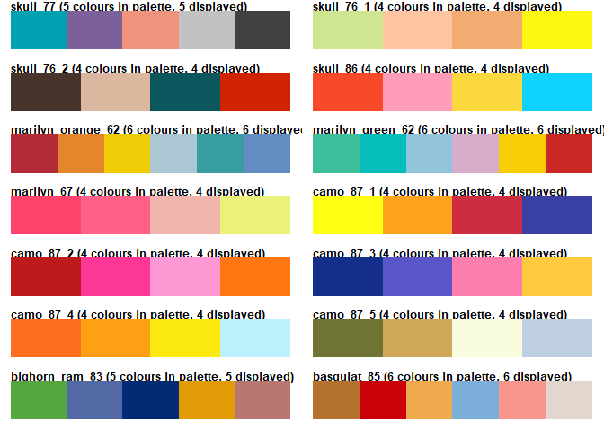
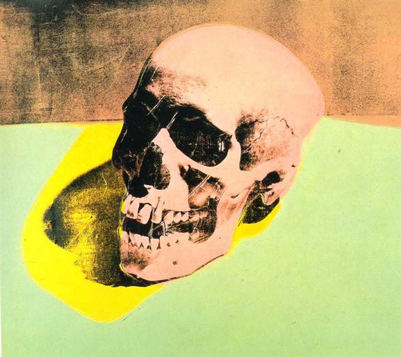
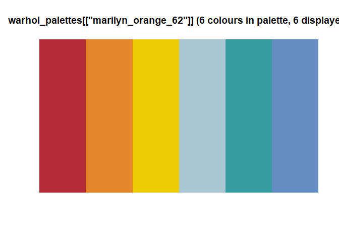
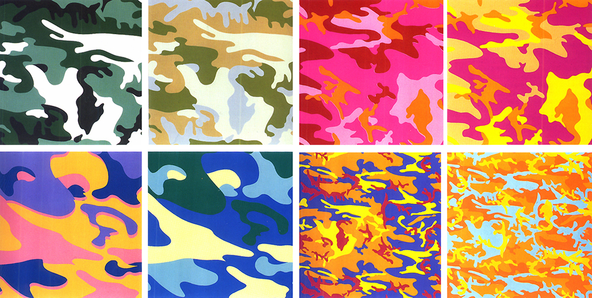
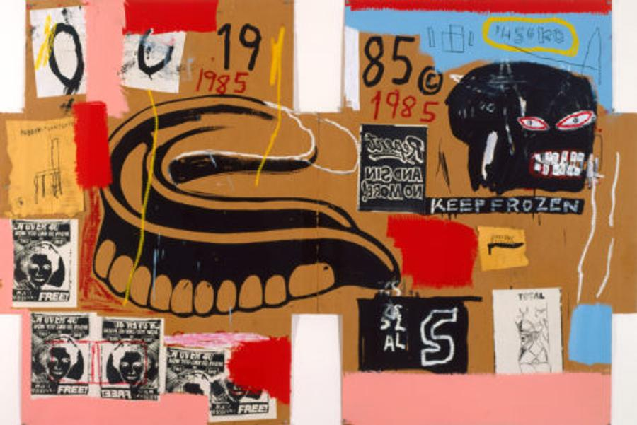
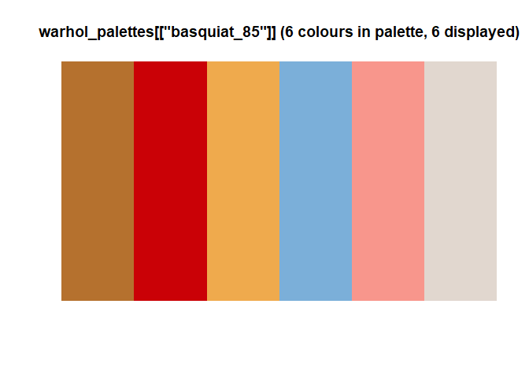
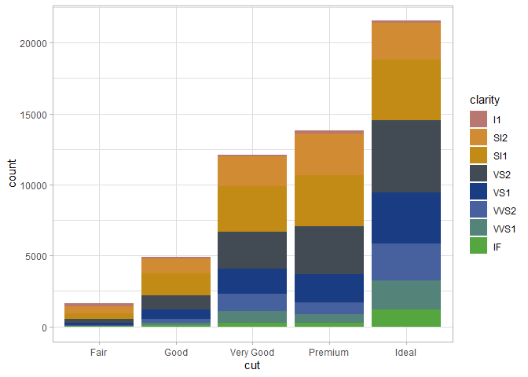

<!-- README.md is generated from README.Rmd. Please edit that file -->

# waRhol

<!-- badges: start -->
<!-- badges: end -->

waRhol is an R package containing colour palettes inspired by the
paintings of Andy Warhol. It can be directly integrated with ggplot and
base R plotting.

## Installation

You can install the development version of waRhol from
[GitHub](https://github.com/) with:

``` r
# install.packages("devtools")
devtools::install_github("alexskeels/waRhol")
```

## Palettes

Here are the palettes:

``` r
library(waRhol)
library(ggplot2)

pal_names <- names(warhol_palettes)

par(mfrow=c(length(warhol_palettes)/2, 2), lheight = 2, mar=rep(1, 4), adj = 0)
for (i in 1:length(warhol_palettes)){
  viz_palette(warhol_palettes[[i]], pal_names[i])
}
```



## inspiration



``` r
viz_palette(warhol_palettes[["skull_76_1"]])
```


``` r
viz_palette(warhol_palettes[["skull_76_2"]])
```


``` r
viz_palette(warhol_palettes[["skull_77"]])
```


``` r
viz_palette(warhol_palettes[["skull_86"]])
```


``` r
viz_palette(warhol_palettes[["marilyn_orange_62"]])
```




``` r
viz_palette(warhol_palettes[["marilyn_green_62"]])
```


``` r
viz_palette(warhol_palettes[["marilyn_67"]])
```




``` r
viz_palette(warhol_palettes[["camo_87_1"]])
```


``` r
viz_palette(warhol_palettes[["camo_87_2"]])
```


``` r
viz_palette(warhol_palettes[["camo_87_3"]])
```


``` r
viz_palette(warhol_palettes[["camo_87_4"]])
```


``` r
viz_palette(warhol_palettes[["camo_87_5"]])
```


``` r
viz_palette(warhol_palettes[["bighorn_ram_83"]])
```




``` r
viz_palette(warhol_palettes[["basquiat_85"]])
```



## Useage examples

Example of a discrete palette in ggplot

``` r
ggplot(diamonds) + 
  geom_bar(aes(x = cut, fill = clarity)) +
  theme_light()+
  scale_fill_warhol(palette="bighorn_ram_83")
```


Example of a continuous palette in base R

``` r
par(mfrow=c(1,1))
pal <- colorRampPalette(warhol_palettes[["skull_76_2"]])
image(volcano, col = pal(20))
```


